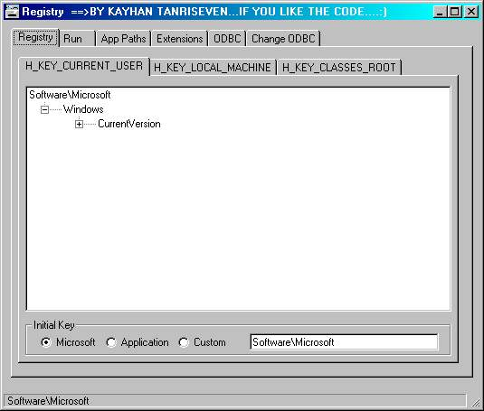



## REGEDIT \(MUCH BETTER THAN WHAT WINDOWS HAS\!\)

### Description

oK. you have seen many regedit examples and also you have seen windows registry editor but this one is the BEST of all!!!!! When you see it please COME BaCK AND VOTE...*Some .bas files are taken from samples and ENHANCED !!!! Check out the screen shot below!!!!!This one also can add and edit 0DBC!! a must see!!!!
 
### More Info
 

             |
---                |---
**Submitted On**   |2000-08-10 13:47:26
**By**             |[VbNick](https://github.com/Planet-Source-Code/PSCIndex/blob/master/ByAuthor/vbnick.md)
**Level**          |Advanced
**User Rating**    |4.0 (40 globes from 10 users)
**Compatibility**  |VB 4\.0 \(32\-bit\), VB 5\.0, VB 6\.0
**Category**       |[Registry](https://github.com/Planet-Source-Code/PSCIndex/blob/master/ByCategory/registry__1-36.md)
**World**          |[Visual Basic](https://github.com/Planet-Source-Code/PSCIndex/blob/master/ByWorld/visual-basic.md)
**Archive File**   |[CODE\_UPLOAD103621022000\.zip](https://github.com/Planet-Source-Code/vbnick-regedit-much-better-than-what-windows-has__1-11839/archive/master.zip)

### API Declarations

in the zip...

